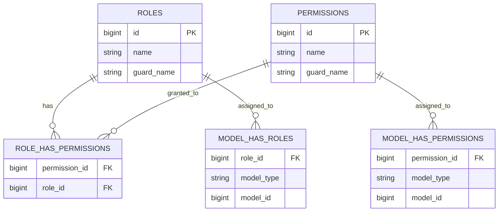

# Entity Relationship Diagram — Summary (As-Is)

## 1. Tujuan dan Notasi

Dokumen ini merekam skema data yang dapat dibuktikan dari migration dan model Eloquent sampai 13 Agustus 2026. Fokus utama adalah tabel bisnis; tabel framework dan authorization diringkas terpisah.

> Fitur Unit Kerja dan Keterlibatan menambah skema secara aditif setelah upgrade Laravel 13 dan Filament 5. Kontrak tabel lama tetap dipertahankan.
>
> Ekstensi Kupang menambah Pengaturan Organisasi, histori Koordinator Unit Kerja, Evaluasi Monev, dan revision append-only. Seluruh tabel bersifat aditif dan Report historis tidak wajib mempunyai evaluasi.

- `PK`: primary key
- `FK`: foreign key yang benar-benar dideklarasikan di migration
- `FK?`: relasi logis/model tanpa constraint database yang teramati
- `UQ`: unique constraint
- `nullable`: nilai boleh kosong

## 2. ERD Domain Bisnis

```mermaid
erDiagram
    USERS ||--o{ REPORTS : writes
    USERS ||--o{ ORDERS : creates
    REPORTS ||--|| DOCUMENTATIONS : has
    REPORTS ||--o{ REPORT_TEAMS : classified_by
    TEAMS ||--o{ REPORT_TEAMS : groups
    REPORTS ||--o{ REPORT_WORK_UNIT : performed_by
    WORK_UNITS ||--o{ REPORT_WORK_UNIT : participates_in
    INVOLVEMENTS o|--o{ REPORTS : classifies
    REPORTS ||--o{ REPORT_USERS : followed_by
    USERS ||--o{ REPORT_USERS : follows
    REPORTS ||--o{ INDICATOR_REPORTS : measured_by
    INDICATORS ||--o{ INDICATOR_REPORTS : classifies
    ORDERS ||--o{ EXECUTORS : assigns
    USERS ||--o{ EXECUTORS : executes
    REPORTS o|--o{ EXECUTORS : result_link

    USERS {
        bigint id PK
        string name
        string email UQ
        timestamp email_verified_at nullable
        string password
        string remember_token nullable
        string avatar_url nullable
        string nip nullable
        string jabatan nullable
        text fcm_token nullable
        boolean status
        timestamp deleted_at nullable
        timestamp created_at
        timestamp updated_at
    }

    REPORTS {
        bigint id PK
        bigint user_id FK
        bigint involvement_id FK_nullable
        string slug UQ
        string no_st
        text what
        text why
        date when
        date tanggal_selesai
        text where
        text who
        text how
        string penyelenggara
        string total_peserta
        string total_wanita
        string kode
        timestamp deleted_at nullable
        timestamp created_at
        timestamp updated_at
    }

    DOCUMENTATIONS {
        bigint id PK
        bigint report_id FK
        string dokumentasi1
        string dokumentasi2 nullable
        string dokumentasi3 nullable
        string st nullable
        string lainnya nullable
        timestamp created_at
        timestamp updated_at
    }

    INDICATORS {
        bigint id PK
        string nama_iku
        string nomor_iku
        string tahun_iku
        string slug_iku
        string status_iku
        timestamp created_at
        timestamp updated_at
    }

    TEAMS {
        bigint id PK
        string nama_tim
        string slug_tim
        string status_tim
        string nomor_tim
        timestamp created_at
        timestamp updated_at
    }

    INDICATOR_REPORTS {
        bigint indicator_id FK
        bigint report_id FK
    }

    REPORT_TEAMS {
        bigint report_id FK
        bigint team_id FK
    }

    REPORT_USERS {
        bigint report_id FK
        bigint user_id FK
    }

    WORK_UNITS {
        bigint id PK
        string name
        string status
        string unit
        timestamp created_at
        timestamp updated_at
    }

    REPORT_WORK_UNIT {
        bigint report_id FK
        bigint work_unit_id FK
    }

    INVOLVEMENTS {
        bigint id PK
        string name UQ
        string status
        boolean is_lprl_organizer
        timestamp created_at
        timestamp updated_at
    }

    ORDERS {
        bigint id PK
        bigint user_id FK
        string order_slug nullable
        date order_date nullable
        time order_time nullable
        date order_finishdate nullable
        string order_status nullable
        text instruction nullable
        text note nullable
        string letter nullable
        timestamp created_at
        timestamp updated_at
    }

    EXECUTORS {
        bigint id PK
        bigint order_id FK
        bigint user_id FK_nullable
        bigint report_id FK_question_nullable
        boolean status
        string proof nullable
        text description nullable
        text task nullable
        timestamp created_at
        timestamp updated_at
    }
```

Catatan kardinalitas: model mendefinisikan `Report::documentation()` sebagai `hasOne`, tetapi database tidak memberi unique constraint pada `documentations.report_id`. Karena itu sifat satu-ke-satu dijaga oleh aplikasi, bukan oleh constraint database.

### 2.1 Singleton identitas deployment

| Kolom `organization_settings` | Tipe/aturan | Fungsi |
|---|---|---|
| `key` | string, unik, default `default` | Menjamin satu konfigurasi aktif per database |
| `app_name` | string nullable | Nama web/aplikasi, misalnya Summary atau Teripang |
| `name`, `short_name` | string | Identitas organisasi |
| `logo_path`, `favicon_path` | string nullable | Path aset pada public disk |
| `address` | text nullable | Alamat organisasi |
| `organizer_name` | string nullable | Nama default kolom Penyelenggara |
| `organizer_input_mode` | string, default `locked` | Kebijakan `locked`, `editable`, atau `manual` |
| `monev_enabled` | boolean, default `false` | Feature flag Evaluasi Monev |
| timestamps | timestamp | Audit waktu perubahan |

## 3. Kamus Relasi

| Dari | Ke | Kardinalitas aplikasi | Implementasi | Perilaku delete |
|---|---|---|---|---|
| `users` | `reports` | 1:N | `reports.user_id` FK | Cascade |
| `reports` | `documentations` | 1:1 secara model | `documentations.report_id` FK | Cascade |
| `reports` | `indicators` | M:N | `indicator_reports` | Pivot cascade dari kedua sisi |
| `reports` | `teams` | M:N | `report_teams` | Pivot cascade dari kedua sisi |
| `reports` | `work_units` | M:N | `report_work_unit` dengan pasangan unik | Cascade saat report dihapus; restrict saat Unit Kerja masih dipakai |
| `involvements` | `reports` | 1:N, opsional pada histori | `reports.involvement_id` nullable | Restrict saat Keterlibatan masih dipakai |
| `work_units` | `users` | M:N berperiode | `work_unit_coordinators`; rentang aktif tidak boleh overlap per unit | Histori dipertahankan; user boleh mengoordinasikan banyak unit |
| `reports` | `report_evaluations` | 1:N | Unik `report_id + work_unit_id + period` | Evaluasi dibatasi pada Unit Kerja yang terhubung ke Report |
| `work_units` | `report_evaluations` | 1:N | FK restrict | Evaluasi unit lain tidak boleh terbaca/tertulis silang |
| `report_evaluations` | `report_evaluation_revisions` | 1:N | FK cascade | Revision hanya insert; perubahan dan identitas editor disimpan dalam transaksi yang sama |
| `organization_settings` | deployment | Singleton aplikasi | `key = default` unik | Identitas dan feature flag lokal deployment |
| `reports` | `users` (followers) | M:N | `report_users` | Pivot cascade dari kedua sisi |
| `users` | `orders` | 1:N | `orders.user_id` FK | Cascade |
| `orders` | `executors` | 1:N | `executors.order_id` FK | Cascade |
| `users` | `executors` | 1:N | `executors.user_id` FK nullable | Cascade bila user dihapus |
| `reports` | `executors` | 1:N logis | `executors.report_id` nullable | Tidak ada FK/cascade pada migration |

## 4. Tabel Pendukung Framework

### 4.1 Authorization (Spatie Permission / Filament Shield)



`model_has_roles` dan `model_has_permissions` bersifat polymorphic; pada aplikasi ini terutama menghubungkan role/permission dengan `users`.

### 4.2 Operasional Laravel/Filament

| Kelompok | Tabel | Fungsi |
|---|---|---|
| Konfigurasi | `settings` | Payload konfigurasi per pasangan unik `group` + `name` |
| Notifikasi | `notifications` | Database notifications polymorphic |
| API token | `personal_access_tokens` | Token Sanctum polymorphic |
| Cache | `cache`, `cache_locks` | Cache aplikasi dan lock |
| Queue | `jobs`, `job_batches`, `failed_jobs` | Antrean dan kegagalan job |
| Import/export | `imports`, `exports`, `failed_import_rows` | Metadata proses Filament import/export |

## 5. Constraint dan Indeks Penting

### Ekstensi organisasi dan Monev

- `organization_settings.key` unik; aplikasi menggunakan singleton `default`. `organizer_input_mode` divalidasi aplikasi terhadap `locked`, `editable`, dan `manual` dengan fallback aman ke `locked`.
- `work_unit_coordinators` diindeks pada unit/rentang. Service memakai transaksi dan lock untuk menolak rentang overlap.
- `report_evaluations(report_id, work_unit_id, period)` unik; `period` disimpan sebagai hari pertama bulan.
- `report_evaluation_revisions(report_evaluation_id, changed_at)` diindeks; model menolak update/delete.
- `users.coordinator_signature_path` adalah path disk privat `local`, bukan URL publik atau binary database.

| Tabel | Constraint teramati |
|---|---|
| `users` | Email unik; primary key `id` |
| `reports` | Slug unik; FK user; nullable FK involvement dengan restrict delete; soft delete |
| `work_units` | Kombinasi `name`, `unit` unik |
| `report_work_unit` | Kombinasi `report_id`, `work_unit_id` unik; kedua kolom FK |
| `involvements` | Nama unik |
| `settings` | Kombinasi `group`, `name` unik |
| `permissions` | Kombinasi `name`, `guard_name` unik |
| `roles` | Kombinasi role/guard unik, dengan variasi bila mode teams aktif |
| `personal_access_tokens` | Token unik |
| `failed_jobs` | UUID unik |

Tidak ditemukan unique composite constraint pada `indicator_reports`, `report_teams`, atau `report_users`.

## 6. Pemetaan Model ke Tabel

| Model | Tabel | Karakteristik |
|---|---|---|
| `User` | `users` | Authenticatable, role/permission, Sanctum, soft delete |
| `Report` | `reports` | Slug route key, soft delete, pusat domain Summary |
| `OrganizationSetting` | `organization_settings` | Singleton branding, identitas deployment, kebijakan Penyelenggara, dan feature flag |
| `WorkUnitCoordinator` | `work_unit_coordinators` | Histori koordinator berperiode |
| `ReportEvaluation` | `report_evaluations` | Isi evaluasi per Report/Unit Kerja/periode |
| `ReportEvaluationRevision` | `report_evaluation_revisions` | Audit diff append-only |
| `Documentation` | `documentations` | Metadata path file laporan |
| `Indicator` | `indicators` | Referensi IKU dengan slug |
| `Team` | `teams` | Referensi tim kerja dengan slug |
| `WorkUnit` | `work_units` | Referensi kantor organisasi aktif dengan status dan kategori tetap |
| `Involvement` | `involvements` | Referensi posisi organisasi aktif dan flag penyelenggara internal |
| `IndicatorReport` | `indicator_reports` | Model pivot |
| `ReportTeam` | `report_teams` | Model pivot |
| `ReportUser` | `report_users` | Model biasa untuk pivot followers; relasi eksplisit dikomentari |
| `Order` | `orders` | Slug route key dan sinkronisasi executor melalui event model |
| `Executor` | `executors` | Assignment order-user dan tautan opsional ke laporan |
| `Setting` | `settings` | Key/value configuration payload |

## 7. Dimensi Analisis yang Sudah Ada

| Dimensi | Sumber data | Penggunaan saat ini |
|---|---|---|
| Waktu kegiatan | `reports.when`, `tanggal_selesai` | Filter dashboard dan report list |
| Penyusun | `reports.user_id` | Total laporan pribadi dan top writer |
| Pengikut | `report_users` | Total laporan sebagai pengikut |
| IKU | `indicators` + `indicator_reports` | Jumlah laporan per IKU |
| Tim kerja | `teams` + `report_teams` | Jumlah laporan per tim |
| Unit kerja | `work_units` + `report_work_unit` | Detail, filter laporan, PDF, dan Excel; terpisah dari tim kerja |
| Keterlibatan | `involvements` + `reports.involvement_id` | Detail, filter laporan, PDF, Excel, dan kendali input Penyelenggara |
| Penyelenggara | `reports.penyelenggara` | Singkatan organisasi aktif dipaksa saat involvement bertanda penyelenggara internal; selain itu diisi manual |
| Peserta | `total_peserta`, `total_wanita` | Ditampilkan/diekspor, belum tampak agregasi dashboard |
| Status order | `orders.order_status`, `executors.status` | Ringkasan progres disposisi |
| Pelaksana | `executors.user_id` | Assignment dan pemantauan penyelesaian |

## 8. Integritas Data yang Perlu Dijaga Saat Update

Bagian ini bukan perubahan yang langsung diterapkan, melainkan daftar kompatibilitas untuk fase desain berikutnya:

1. Pertahankan route key berbasis slug untuk laporan, IKU, tim, dan order.
2. Pertahankan makna `reports.user_id` sebagai penyusun utama dan `report_users` sebagai pengikut.
3. Jangan mengubah pivot menjadi dimensi lain tanpa migrasi historis yang eksplisit.
4. Perlakukan file pada `documentations` sebagai path storage, bukan binary database.
5. Audit `executors.report_id` sebelum menambah FK karena data lama mungkin memuat orphan/null.
6. Audit pasangan duplikat sebelum menambah unique composite pada pivot lama; `report_work_unit` sudah mempunyai unique composite sejak dibuat.
7. Audit nilai aktual `executors.status` sebelum mengubah tipe/status vocabulary.
8. Validasi dua migration `personal_access_tokens` sebelum fresh migration atau upgrade framework.

## 9. Sumber Implementasi Utama

- `database/migrations/*`
- `app/Models/*`
- `app/Filament/Resources/*`
- `app/Filament/Widgets/*`
- `app/Console/Commands/*`
- `routes/web.php`, `routes/api.php`, `routes/console.php`
- `app/Providers/Filament/AdminPanelProvider.php`
