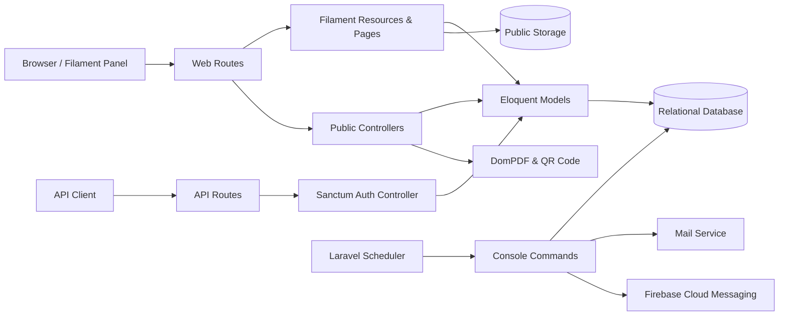

# Product Requirements Document — Summary

> Pembaruan 13 Agustus 2026: satu source mendukung deployment Sorong dan Kupang yang terpisah. Nama aplikasi, logo, favicon, identitas organisasi, dan perilaku Penyelenggara berasal dari Pengaturan Organisasi; Evaluasi Monev digate dan default-nya nonaktif.

## 1. Status Dokumen

- Jenis: dokumentasi produk **as-is**
- Tanggal pembaruan: 13 Agustus 2026
- Sumber kebenaran: source code aplikasi, migration, model Eloquent, resource Filament, route, controller, command terjadwal, dan dependency manifest
- Cakupan: aplikasi inti; source vendor, cache, log, dan hasil build tidak dianalisis sebagai logika bisnis
- Catatan: dokumen ini tidak menetapkan perubahan atau desain versi berikutnya

## 2. Ringkasan Produk

Aplikasi ini adalah platform internal berbasis Laravel dan Filament untuk mencatat, mengelola, menyajikan, dan menganalisis laporan kegiatan dengan format 5W1H. Deployment dapat memakai nama web berbeda, misalnya Summary di Sorong dan Teripang di Kupang. Laporan dapat dikaitkan dengan penyusun, pengikut, indikator kinerja (IKU), tim kerja, Unit Kerja organisasi aktif, jenis keterlibatan, dokumentasi, surat tugas, dan tanda tangan.

Aplikasi juga memiliki modul disposisi/order untuk menugaskan pekerjaan kepada satu atau lebih pelaksana. Pelaksana dapat mencatat status, bukti, deskripsi, tugas, dan menghubungkan hasilnya ke laporan Summary. Pengingat diberikan melalui email dan Firebase Cloud Messaging (FCM).

## 3. Tujuan Produk Saat Ini

1. Menstandarkan pencatatan kegiatan dalam struktur 5W1H.
2. Menyimpan bukti kegiatan dan dokumen pendukung dalam satu rekaman.
3. Mengaitkan laporan dengan IKU, tim kerja, Unit Kerja, dan keterlibatan organisasi aktif untuk analisis.
4. Menunjukkan kontribusi penyusun dan pengikut laporan.
5. Menyediakan keluaran PDF, QR, verifikasi tanda tangan, dan Excel.
6. Mengelola disposisi tugas dan memantau penyelesaiannya.
7. Membatasi akses dan tindakan berdasarkan role/permission.

## 4. Pengguna dan Peran

| Aktor | Kebutuhan utama | Bukti implementasi |
|---|---|---|
| Super admin | Mengelola seluruh data, user, role, dan permission | Filament Shield dan `RoleResource` |
| Admin | Mengelola data operasional dan referensi | Akses panel berbasis role |
| Writer | Menulis serta mengelola laporan | `ReportResource` dan policy |
| Panel user | Mengakses panel sesuai permission | `User::canAccessPanel()` |
| Katimja | Mengakses panel dan fungsi yang diizinkan | Role `katimja` pada akses panel |
| Penyusun | Menjadi pemilik/penulis utama laporan | `reports.user_id` |
| Pengikut | Dicatat sebagai kontributor/pengikut laporan | Pivot `report_users` |
| Pemberi disposisi | Membuat order dan memilih pelaksana | `orders.user_id`, `OrderResource` |
| Pelaksana | Menerima tugas, mengisi status/bukti, dan mengaitkan laporan | Tabel `executors` |
| Pengunjung tautan publik | Melihat PDF, dokumen, storage publik, dan verifikasi tanda tangan | Route publik di `routes/web.php` |
| Klien API | Login dan membaca profil melalui bearer token | Sanctum pada `routes/api.php` |

Role menentukan akses ke panel; izin tindakan CRUD dan tindakan khusus ditangani oleh Filament Shield/Spatie Permission melalui policy.

## 5. Ruang Lingkup Fungsional

### 5.1 Autentikasi dan profil

- Login, registrasi, reset password, verifikasi email, dan edit profil tersedia melalui panel Filament.
- User hanya dapat mengakses panel bila memiliki salah satu role: `super_admin`, `admin`, `writer`, `panel_user`, atau `katimja`.
- Profil user menyimpan nama, email, password, avatar, NIP, jabatan, token FCM, dan status aktif.
- API menyediakan login email/password dan menghasilkan personal access token Sanctum.
- Endpoint `/api/user` mengembalikan user terautentikasi.

### 5.2 Laporan Executive Summary 5W1H

Setiap laporan menyimpan:

- penyusun dan pengikut;
- nomor surat tugas;
- `what`, `why`, `when`, tanggal selesai, `where`, `who`, dan `how`;
- penyelenggara;
- total peserta dan persentase wanita;
- tanda tangan dalam kolom `kode`;
- slug unik untuk URL publik;
- relasi ke IKU dan tim kerja;
- relasi ke minimal satu unit kerja yang melaksanakan kegiatan;
- satu jenis keterlibatan organisasi;
- dokumentasi kegiatan, surat tugas, dan dokumen lain.

Perilaku utama:

- Penyusun default adalah user yang sedang login dan hanya user berstatus aktif yang ditawarkan.
- Pengikut dapat dipilih lebih dari satu.
- IKU dan tim kerja dapat dipilih lebih dari satu; form memprioritaskan referensi aktif.
- Unit kerja dapat dipilih lebih dari satu dan berbeda secara semantik dari tim kerja; laporan baru atau laporan lama yang diedit wajib mempunyai minimal satu unit kerja.
- Keterlibatan dipilih satu. Bila jenisnya ditandai sebagai organisasi penyelenggara, nilai Penyelenggara diisi dari singkatan Pengaturan Organisasi; jenis lain mewajibkan input manual.
- Laporan historis boleh belum mempunyai unit kerja dan keterlibatan sampai record diedit; sistem tidak menebak nilai lama.
- Isi `how` memakai rich-text editor.
- Laporan menggunakan soft delete serta menyediakan restore/force delete sesuai izin.
- Daftar dapat dicari, diurutkan, dipaginasi, dan difilter berdasarkan rentang tanggal, IKU, tim, unit kerja, keterlibatan, penyusun, serta status trash.
- Record terpilih dapat diekspor ke Excel.
- Gaze dipakai untuk menampilkan/mengendalikan kehadiran pengguna pada form.

### 5.3 Dokumentasi laporan

- Satu laporan mempunyai satu record dokumentasi.
- Dokumentasi utama wajib berupa gambar; dua gambar tambahan bersifat opsional.
- Surat tugas dan dokumen lain bersifat opsional serta menerima beberapa tipe dokumen/gambar.
- File disimpan pada disk `public` di direktori `dokumentasi`, `st`, atau `lainnya`.
- Command harian menghapus file public yang tidak lagi direferensikan oleh dokumentasi, avatar, atau pengaturan PWA.

### 5.4 Referensi IKU

- Menyimpan nama, nomor, tahun, slug, dan status IKU.
- IKU dapat terkait dengan banyak laporan dan sebaliknya.
- IKU aktif menjadi pilihan pada form laporan.
- Dashboard menghitung jumlah laporan per IKU aktif dalam rentang tanggal.

### 5.5 Referensi tim kerja

- Menyimpan nama, nomor, slug, dan status tim.
- Tim dapat terkait dengan banyak laporan dan sebaliknya.
- Tim aktif menjadi pilihan pada form laporan.
- Dashboard menghitung jumlah laporan per tim aktif dalam rentang tanggal.

### 5.6 Referensi unit kerja dan keterlibatan

- Unit Kerja mencatat kantor di bawah naungan organisasi aktif yang mengerjakan kegiatan, bukan tim kerja internal.
- Setiap Unit Kerja mempunyai nama, status aktif/nonaktif, dan kategori tetap: Satuan Pelayanan, Wilayah Kerja, atau Gerai Pelayanan.
- Report dan Unit Kerja berelasi many-to-many melalui `report_work_unit`.
- Keterlibatan adalah master fleksibel untuk posisi organisasi aktif pada kegiatan, misalnya Penyelenggara, Peserta, Sponsor, atau Pemberi Modal.
- Penanda `is_lprl_organizer` menentukan apakah kebijakan Penyelenggara organisasi diterapkan. Nama kolom legacy dipertahankan untuk kompatibilitas dan label UI digeneralisasi.
- Pengaturan Organisasi menentukan nama default Penyelenggara dan mode `locked`, `editable`, atau `manual`. Mode `locked` dipaksa server-side; `editable` hanya memberi default pada nilai kosong; `manual` tidak mengisi otomatis.
- Nama Keterlibatan bebas per deployment, termasuk Penyelenggara/Peserta atau Internal/Eksternal, tanpa pencocokan teks pada domain logic.
- Master yang sudah digunakan tidak dihapus; admin menonaktifkannya agar histori tetap utuh.

### 5.7 Branding dan identitas deployment

- `app_name` adalah nama web/aplikasi dan terpisah dari nama serta singkatan organisasi.
- Logo panel dan favicon dapat diunggah per deployment dalam format JPEG, PNG, atau WebP, maksimal 2 MB; SVG tidak diterima.
- Aset hanya dipakai bila masih tersedia pada public disk. Jika kosong atau hilang, panel dan email menggunakan aset Summary bawaan.
- Seluruh pembacaan setting menggunakan `OrganizationContext`, dengan fallback `.env`, tanpa kondisi berdasarkan kota atau domain.

### 5.8 Dashboard analitik

Dashboard mendukung filter tanggal mulai dan tanggal selesai, lalu menampilkan:

- total seluruh laporan 5W1H;
- total laporan yang ditulis user aktif;
- total laporan yang diikuti user aktif;
- jumlah laporan per IKU aktif;
- jumlah laporan per tim kerja aktif;
- penulis terbanyak bulan berjalan;
- penulis terbanyak tahun berjalan.

Tanggal analisis menggunakan kolom kegiatan `reports.when`, bukan tanggal pembuatan record.

### 5.9 PDF, QR, tanda tangan, dan tampilan publik

- Route `/pdf/{report}` menghasilkan PDF streaming berdasarkan slug laporan.
- PDF menyertakan QR menuju laporan, surat tugas, dan dokumentasi lain.
- PDF menampilkan Unit Kerja, Keterlibatan, dan Penyelenggara.
- Route `/cek-ttd/{report}` menampilkan halaman verifikasi tanda tangan.
- Route public storage melayani file dari disk public melalui controller khusus.
- Halaman khusus tersedia untuk melihat surat tugas dan dokumentasi lainnya.

### 5.10 Ekspor Excel

Ekspor laporan terpilih memuat penyusun, pengikut, nomor ST, 5W1H, IKU, tim, Unit Kerja, Keterlibatan, Penyelenggara, peserta, dan persentase wanita. Isi rich text `how` diubah menjadi teks biasa, tanggal diformat `dd-mm-YYYY`, dan lembar menggunakan font Arial serta wrap text.

Ekspor Monev adalah action independen dari pemilihan baris. Pengguna memilih Unit Kerja, bulan, tahun, lokasi, dan tanggal tanda tangan. Dataset memuat Report pada Unit Kerja yang rentangnya overlap periode, atau Report lama yang mempunyai evaluasi pada periode itu. INTERNAL ditentukan oleh `involvements.is_lprl_organizer`; selain itu EKSTERNAL. Excel mengikuti matriks 10 kolom, memakai koordinator aktif dan tanda tangan privat, menetralkan formula, dan membatasi bukti pada HTTP/HTTPS.

### 5.10.1 Evaluasi Monev

- Satu evaluasi unik untuk kombinasi Report, Unit Kerja, dan periode hari pertama bulan.
- Field narasi dan daftar URL bersifat nullable; tidak ada record kosong yang dibuat otomatis.
- Penulis/pengikut Report dapat mengelola seluruh unit Report terkait; koordinator aktif hanya unitnya; admin/super-admin atau ability `manage_all_report_evaluations` bersifat global.
- Setiap create/update menyimpan diff append-only pada transaksi yang sama. No-op tidak membuat revision.
- Action export memerlukan ability `export_report_evaluations`. UI hanya ada bila Pengaturan Organisasi mengaktifkan Monev.

### 5.11 Disposisi/order

Order menyimpan pemberi tugas, tanggal/waktu, tanggal selesai, status, instruksi, catatan, surat, dan slug.

- Satu order mempunyai banyak executor.
- Executor menghubungkan order dengan user pelaksana.
- Executor dapat menyimpan status, bukti, deskripsi, tugas, dan referensi laporan hasil.
- Pemilihan user saat order dibuat menghasilkan record executor berstatus awal pending/false.
- Perubahan daftar user mengganti kumpulan executor yang ada.
- Widget menampilkan ringkasan jumlah order/pelaksana selesai sesuai implementasi resource.

### 5.12 Notifikasi dan pekerjaan terjadwal

| Jadwal | Command | Perilaku |
|---|---|---|
| Setiap menit | `app:send-order-notifications` | Mencari order sekitar satu jam sebelum waktu pelaksanaan dan mengirim FCM kepada executor yang memiliki token |
| Setiap hari 08:00 | `app:send-email-reminder` | Mengirim email kepada executor untuk order pada hari tersebut |
| Setiap hari 02:00 | `app:delete-unused-files` | Menghapus file public yang tidak direferensikan |

### 5.13 Administrasi dan keamanan

- User, role, permission, IKU, tim, Unit Kerja, Keterlibatan, laporan, dan order dikelola melalui resource Filament.
- Policy untuk resource utama menggunakan permission Filament Shield.
- Panel mengaktifkan database notifications, database transactions, unsaved-change alerts, session authentication, CSRF, dan route model binding.

## 6. Arsitektur Sistem As-Is

## 7. Dependensi Teknis Utama

| Area | Implementasi teramati |
|---|---|
| Runtime | PHP `^8.3` |
| Framework | Laravel `~13.0` (hasil modernisasi; baseline observasi: Laravel 12) |
| Admin UI | Filament `~5.0` (hasil modernisasi; baseline observasi: Filament 3) |
| Authorization | Filament Shield `~4.0`, Spatie Permission |
| API auth | Laravel Sanctum `^4.0` |
| PDF | `barryvdh/laravel-dompdf` |
| QR | `endroid/qr-code` |
| Excel | `maatwebsite/excel` |
| Push notification | Firebase/Kreait dan Firebase JS SDK |
| Slug | `spatie/laravel-sluggable` |
| Form | Filament RichEditor, Autograph Signature Pad, Filament Gaze |
| Frontend build | Vite 5 |

Baseline awal menggunakan Laravel 12 dan Filament 3. Modernisasi framework telah dilakukan ke Laravel 13 dan Filament 5 tanpa perubahan skema database; rincian kompatibilitas dan verifikasinya dicatat di `UPGRADE_LARAVEL_13_FILAMENT_5.md`.

## 8. Aturan Data yang Teramati

- Slug laporan unik; slug IKU, tim, dan order dipakai untuk route model binding tetapi tidak seluruhnya diberi unique constraint pada migration.
- Hapus user akan menghapus laporan dan order miliknya melalui foreign key cascade.
- Hapus laporan akan menghapus dokumentasi dan record pivot IKU/tim/pengikut.
- Hapus laporan akan menghapus pivot Unit Kerja; Unit Kerja dan Keterlibatan yang masih dipakai dilindungi oleh foreign key restrict.
- `reports.involvement_id` nullable untuk kompatibilitas laporan historis, sedangkan form create/edit mewajibkannya.
- `executors.report_id` bersifat nullable dan model mendefinisikan relasi ke laporan, tetapi migration tidak menambahkan foreign-key constraint.
- Pivot laporan–IKU, laporan–tim, dan laporan–pengikut tidak mempunyai primary key, timestamp, atau unique composite constraint.
- User dan report memakai soft delete; domain lain umumnya hard delete.
- `total_peserta` dan `total_wanita` disimpan sebagai string meskipun dipakai sebagai angka/persentase.

## 9. Kebutuhan Nonfungsional yang Tampak

- Akses panel harus diautentikasi dan diotorisasi berbasis role/permission.
- Perubahan form harus dilindungi CSRF dan database transaction.
- File laporan harus dapat dibuka dari URL publik yang dibentuk aplikasi.
- Dashboard harus mendukung analisis rentang tanggal.
- Export harus dapat diunduh langsung dari panel.
- Scheduler dan worker/infrastruktur terkait harus aktif agar email, FCM, dan pembersihan file berjalan.
- Relasi model dan migration harus dipertahankan kompatibel selama modernisasi.

## 10. Batasan dan Temuan Historis

Temuan berikut bukan instruksi perubahan; ini adalah hal yang perlu dipertimbangkan pada fase update berikutnya:

1. `composer.json` mendeklarasikan Laravel 12 tetapi Filament masih mayor versi 3; kompatibilitas versi aktual perlu diverifikasi sebelum menentukan target upgrade.
2. Terdapat dua migration pembuatan `personal_access_tokens` dengan struktur/nama tabel yang sama.
3. `executors.report_id` belum memiliki constraint ke `reports`.
4. Pivot bisnis belum mencegah pasangan relasi duplikat pada tingkat database.
5. `ReportResource` mengasumsikan record dokumentasi tersedia pada beberapa jalur tampilan/PDF.
6. URL pada pembentukan QR mengandung domain produksi secara langsung di controller.
7. `Order` menyinkronkan executor dari objek request di event model; perilaku ini perlu dijaga saat refactor.
8. Nilai status executor pada migration adalah boolean, sedangkan kode pembuatan menggunakan literal `pending`; perilaku aktual bergantung pada konversi database/runtime.
9. Pembersihan file merupakan operasi destruktif terjadwal dan daftar referensinya perlu diuji ketat saat skema file diperluas.
10. Beberapa endpoint file/dokumen bersifat publik; model otorisasi dan kebutuhan publiknya perlu dikonfirmasi pada PRD versi target.

## 11. Di Luar Cakupan Dokumen Ini

- Target versi Laravel/Filament berikutnya.
- Agregasi dashboard baru untuk Unit Kerja atau Keterlibatan di luar filter laporan.
- Perubahan UX, permission, API, atau alur bisnis.
- Strategi migrasi data, deployment, rollback, dan pengujian upgrade.
- Penilaian kualitas/kelengkapan isi database produksi.

## 12. Kriteria Penerimaan Dokumentasi

- Modul bisnis utama, aktor, alur, dan integrasi teridentifikasi.
- Entitas serta relasi data dapat ditelusuri ke migration/model.
- Perbedaan antara fakta implementasi dan kandidat perbaikan dinyatakan jelas.
- Dokumen dapat menjadi input untuk diskusi update tanpa mengubah sistem berjalan.
